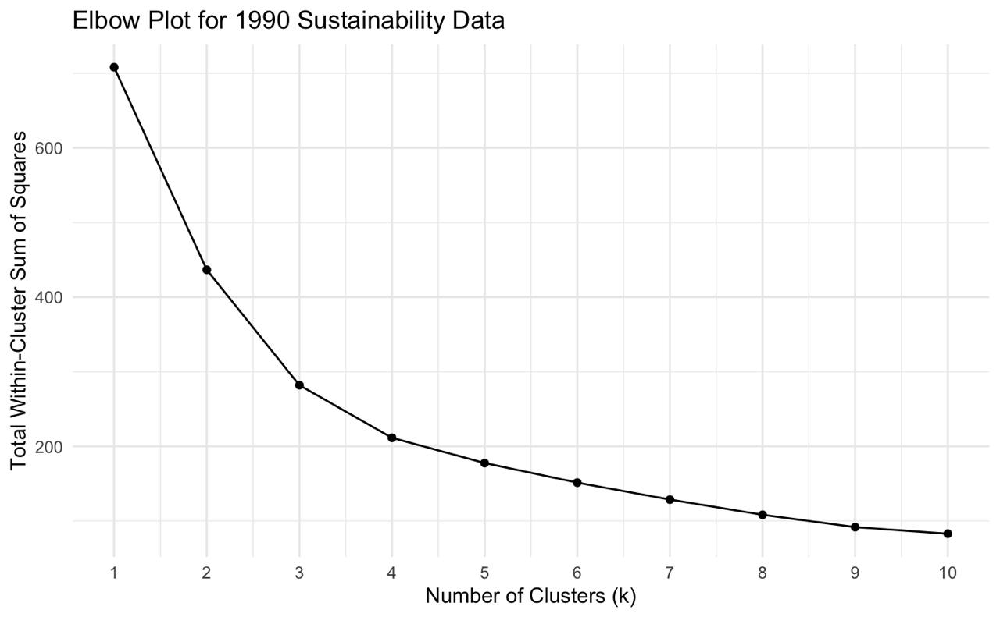
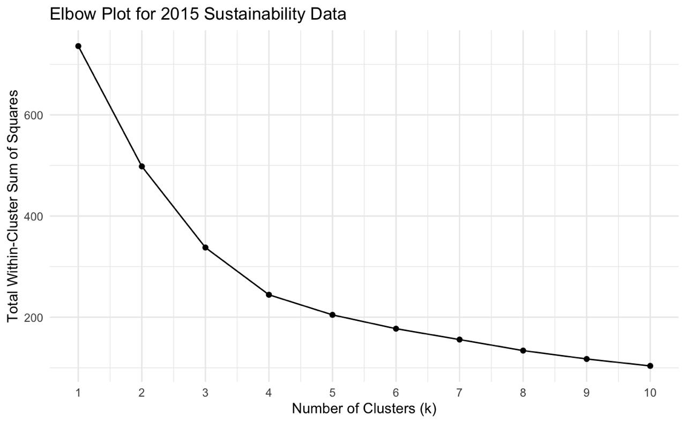

## Data collection

Data used in this project comes from datasets accessed through the [World Bank](https://www.worldbank.org/ext/en/home). Climate change indicators are retrieved from the [Climate Change dataset](https://data.worldbank.org/topic/climate-change). We selected 6 variables, including Renewable energy consumption (% of total final energy consumption), Electricity production from oil sources (% of total), Electricity production from coal sources (% of total), Renewable electricity output (% of total electricity output), Population growth (annual %), Forest area (% of land area). Data on individual countries spans across the 1990 - 2022 year period. Some countries have NA values for all or certain variables if the information is not updated regularly.
In order to plot and analyze carbon emissions data, we used the [Carbon dioxide (CO2) emissions](https://data.worldbank.org/indicator/EN.GHG.CO2.ZG.AR5) data from the World Bank. It contains observations for each country on emissions within the 1991-2023 year period.

## Data wrangling

Before proceeding to the analysis, we cleaned up the data and combined rows of the two datasets. Specifically, we removed unused columns, selected variables of interest, imputed geographic data to plot the map outlines, filtered relevant years and calculated median values for each of the continents. For the k-means clustering, we normalized the data to amke sure the variables are on the same scale. Using an elbow plot, we identified the optimal number of clusters and added cluster assignments. Cluster assignments are created for 2-year periods to compare how countries are distributed across the indicators and years.

## Methods

After wrangling, we mapped changes in CO2 emissions, using `sf` and `ggplot2` packages. We plot time-series data on indicators of interest, and built a [Shiny app](https://03t37e-mariia-koval.shinyapps.io/sustainability-indicators/) allows to observe the effects of these indicators on individual countries and continents across the period from 1990 to 2020. 

Throughout the blog, we employed data visualization, clustering, and predictive modeling to analyze sustainability patterns across countries. We began with map which showed the trend in CO2 emissions of each country. We also included line graphs for different sustainbability and nature related variables trends over time. 

To identify groups of countries with similar sustainability profiles, we used k-means clustering on standardized indicators such as renewable energy consumption and electricity production from coal and oil. We applied the elbow method to determine the optimal number of clusters, selecting k = 4 based on the elbow plot. This helped us segment countries into more and less sustainable groups and track their transitions over time.

# Appendix

**K-means Clustering**: The elbow plots below were used to determine the optimal number of cluster groups (k) for countries based on their sustainability levels. Not all seven sustainability indicators were considered in the k-means clustering model because the goal was to prioritize the sustainability indicators that signal robust economic activity and is thus prone to annual fluctuations, such as renewable energy consumption, renewable electricity output, as well as electricity production from oil and coal sources. We determined that 4 cluster groups was the optimal amount to proceed with our analysis.

## References

**Web Sources & Reports**

* 3 Direct Solar Energy, www.ipcc.ch/site/assets/uploads/2018/03/Chapter-3-Direct-Solar-Energy-1.pdf. Accessed 4 May 2025. 
* “How Halting Deforestation Can Help Counter the Climate Crisis.” UNEP, * www.unep.org/news-and-stories/story/how-halting-deforestation-can-help-counter-climate-crisis. Accessed 4 May 2025. 
* United Nations. “Emissions Gap Report 2024.” UNEP, www.unep.org/resources/emissions-gap-report-2024. Accessed 4 May 2025. 
* United Nations. “Methane Alert and Response System (MARS).” UNEP, www.unep.org/topics/energy/methane/international-methane-emissions-observatory/methane-alert-and-response-system. Accessed 4 May 2025. 

**Datasets**

* World Bank. Climate Change. World Bank, https://data.worldbank.org/topic/climate-change. Accessed 4 May 2025.
* World Bank. Carbon Dioxide (CO₂) Emissions (EN.GHG.CO2.ZG.AR5). World Bank, https://data.worldbank.org/indicator/EN.GHG.CO2.ZG.AR5. Accessed 4 May 2025.

**R Packages & Technical Resources**

* Chang, Winston. “Shinylive Extension.” Quarto, 25 Oct. 2022, quarto.org/docs/blog/posts/2022-10-25-shinylive-extension/. 
* Grolemund, Hadley Wickham and Garrett. “R for Data Science.” 19 Functions, r4ds.had.co.nz/functions.html#function-arguments. Accessed 4 May 2025. 
* “Interactivity.” Quarto, quarto.org/docs/interactive/#shiny. Accessed 4 May 2025. 
* Radečić, Dario. “Observe Function in R Shiny - How to Implement a Reactive Observer.” RSS, www.appsilon.com/post/observe-function-r-shiny. Accessed 4 May 2025. 
* “Randomforest: Breiman and Cutlers Random Forests for Classification and Regression.” The Comprehensive R Archive Network, Comprehensive R Archive Network (CRAN), 22 Sept. 2024, https://cran.r-project.org/web/packages/randomForest/randomForest.pdf. 
* Various authors. R Packages Used: viridis, tidyverse, ggplot2, lubridate, knitr, dplyr, purrr, broom, sf, rnaturalearth, janitor, countrycode, stringr, GGally, tidyr, kableExtra, shinylive, randomForest, plotly.